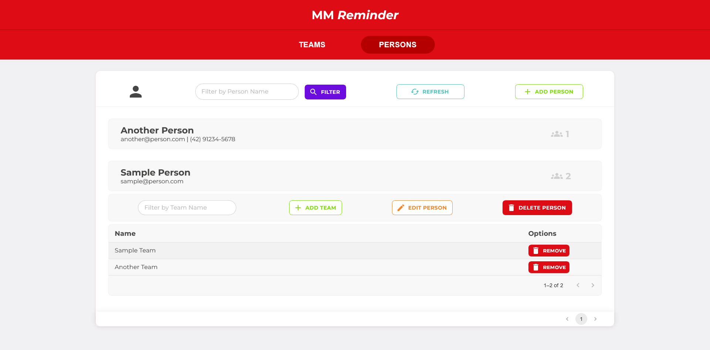

# Proposta do projeto

Problema: PROPOSTA A

Aqui somos um time muito unido e integrado, gostamos de nos comunicar, porém somos esquecidos. :(

Você pode nos ajudar criando um sisteminha que permita a armazenagem do nome, email e telefone de cada pessoa do time?
 
Vai ser legal se você criar uma aplicação em Node + React/Angular, mas fique livre para escolher suas tecnologias. No banco, você pode usar NeDB para facilitar. 

Alguns pontos importantes:
- Use sua criatividade, valorizamos muito o frontend e a experiência;
- Não se esqueça das validações;
- Faça um CRUD completo.

## Sobre a Implementação

O sistema consiste em 2 partes: 

Frontend
- React (Vite)
- Typescript
- React Query
- SCSS
- MUI

Backend
- Node.js
- Typescript
- REST-Api
- Express
- Prisma (ORM)
- SQLite

## Instalando e Rodando

- Requisitos: Node.js, npm.

Baixe o arquivo ZIP do projeto, descompacte-o onde preferir e acesse a pasta. <br>

Ou clone utilizando git no diretorio desejado: 
```bash
git clone https://github.com/CaduVarela/MMReminder.git
```
<br>
Execute estes passos para rodar as 2 partes da aplicação:

Frontend:
1. Abra um terminal dentro da pasta "frontend" e execute o comando <code>npm install</code>.
2. execute o comando <code>npm run build</code> no mesmo diretório para construir a aplicação.
3. execute o comando <code>npm run preview</code> no mesmo diretório para rodar a aplicação.
4. A aplicação estará rodando na URL: <b><a>http://localhost:5001</a></b>

Backend:
1. Abra outro terminal dentro da pasta "backend" e execute o comando <code>npm install</code>.
2. execute o comando <code>npm run build</code> no mesmo diretório para construir a aplicação.
3. execute o comando <code>npm run preview</code> no mesmo diretório para rodar a aplicação.
4. A aplicação estará rodando na URL: <b><a>http://localhost:3000</a></b>

## Sobre o Projeto

Esse projeto é um sistema simples para gerenciar times e pessoas. 

O projeto possui duas telas principais as quais podem ser acessadas a partir do menu no topo da tela, uma de para <b>Times</b> (Teams) e outra para <b>Pessoas</b> (Persons):

### Detalhes

- Todas as pesquisas são paginadas e as paginas podem ser acessadas por botões na parte inferior do respectivo elemento.

- Todas as telas são responsivas para navegadores desktop.

### Times


Nesta pagina serão listadados todos os times presentes no banco de dados. Também é possivel filtrar pelo nome do time, criar, editar ou deletar times.

Para acessar as funcionalidades de cada time, basta clicar no cartão do time para abrir um menu de controle e também listar todas as pessoas presentes nele.

### Pessoas



De maneira muito similiar, esta pagina possui todas as funcionalidades da pagina de time, porém desta vez serão listadas todas as pessoas e você podera gerenciar os times de cada pessoa.

## Obrigado!

Obrigado por vizitar meu projeto! :)